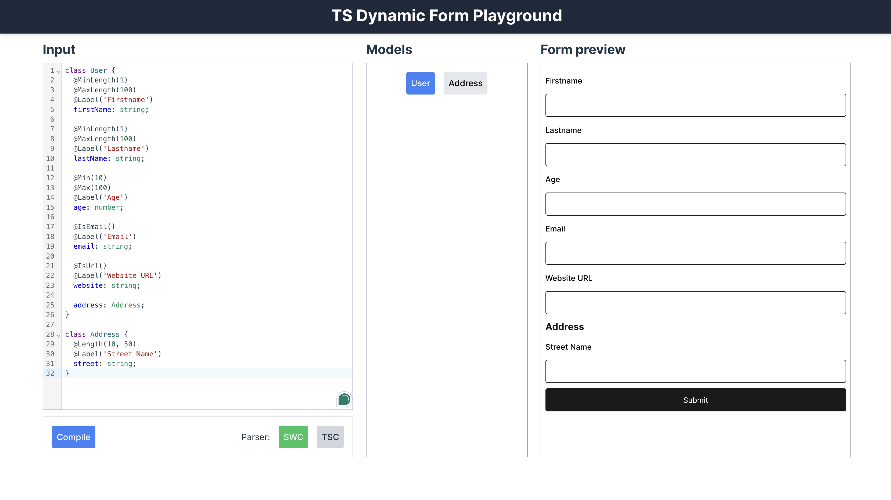

## Overview

**TS Dynamic Forms** is a TypeScript-first utility that simplifies the creation of dynamic, type-safe forms in React. It generates form schemas based on TypeScript models and dynamically builds forms using [React Hook Form](https://react-hook-form.com/). By aligning forms with your TypeScript types, it reduces manual form setup, minimizes boilerplate, and enhances code maintainability.

⚠️ **Note:** This module is experimental and not ready for production use. It is designed for testing and exploration while evaluating its applicability to real-world scenarios.

## Key Features

- **TypeScript-Driven**: Form schemas are automatically generated from your TypeScript models.
- **Dynamic Form Generation**: Build forms dynamically without manual configuration.
- **Seamless Integration**: Works natively with [React Hook Form](https://react-hook-form.com/).
- **Type-Safe**: Ensures all form fields align with your TypeScript definitions.
- **Customizable and Extensible**: Provides full flexibility for custom use cases and extensions.

## Directory Structure

```bash
ts-dynamic-forms/
├── packages/
│   ├── core/            # Core logic for parsing TypeScript schemas and generating form configurations
│   ├── ui/       # React components responsible for rendering dynamic forms based on schemas
│   ├── utils/           # Utility functions and helpers for form generation and validation
│   ├── preview-editor/  # A playground environment to preview and interact with forms in the browser
│   └── plugins/         # Extensions for customizing schema parsing and form generation
├── README.md            # Project documentation
└── package.json         # NPM configuration and dependencies
```

## Installation

1. Clone the repository:
    ```bash
    git clone https://github.com/medric/ts-dynamic-forms
    cd ts-dynamic-forms
    ```

2. Install dependencies:
    ```bash
    npm install
    ```

## Usage

### 1. Define TypeScript Models

Start by defining your TypeScript model, which acts as the foundation for generating the form schema.

For now, **class-based models with decorators are preferred**, as they offer more comprehensive validation support and flexibility. Using the `type` syntax works only on the server-side with the `DynamicFormTsParser`, but the class syntax is more stable and recommended.

```ts
// Class-based syntax with decorators for validation
class User {
  @MinLength(1)
  @MaxLength(100)
  @Label('Firstname')
  firstName: string;

  @MinLength(1)
  @MaxLength(100)
  @Label('Lastname')
  lastName: string;

  @Min(10)
  @Max(100)
  @Label('Age')
  age: number;

  @IsEmail()
  @Label('Email')
  email: string;

  @IsUrl()
  @Label('Website URL')
  website: string;

  address: Address;
}

class Address {
  @Length(10, 50)
  @Label('Street Name')
  street: string;
}
```

Available decorators include:

```ts
@MinLength(10)
@MaxLength(10)
@Length(0, 10)
@Min(10)
@Max(10)
@Label('Label')
@IsEmail()
@IsUrl()
@Pattern('/^[A-Za-z]$/')
@Message('Please provide a valid value')
@Required()
```

Validation rules defined in these classes are used by the `<DynamicForm />` component, leveraging React Hook Form's validation system.

Alternatively, if you prefer the type syntax, note that this approach is **only functional server-side** using the `DynamicFormTsParser`. In the `DynamicFormTsParser`, comments are used for validation rules, but the annotations match the decorators used in the class-based syntax (e.g., `@MinLength`, `@MaxLength`, etc.):

```ts
// form-types.ts
type Ref1 = {
  name: string;
};

type MyType = {
  /**
   * @MinLength(5)
   * @MaxLength(10)
   */
  kind: string;

  ref: Ref1;

  refs: Ref1[];

  comments: string[];
};

// server.ts
import { DynamicFormTsParser } from './packages/core/';

const parser = new DynamicFormTsParser({
  formSchemaTypeDefinitionsFile: './example/schema.ts',
});

async function run() {
  const data = await parser.parse();
  const formSchema = JSON.stringify(data, null, 2);

  return formSchema;
}
```

### 2. Generate Form Schema

There are multiple ways to generate form schemas depending on the syntax you're using:

- **Prefer `type` syntax**: Use `DynamicFormTsParser` for server-side schema generation. This parser relies on leading comments for validation annotations.
- **Prefer `class` syntax**: Use `DynamicFormParser` or `DynamicFormWasmParser` for schema generation on both client and server. These parsers leverage decorators for validation.

#### DynamicFormParser & DynamicFormWasmParser

Under the hood, both `DynamicFormParser` and `DynamicFormWasmParser` use [swc](https://swc.rs/) to parse the TypeScript code. However, these parsers **do not support type declaration syntax** and work exclusively with class-based models.

```ts
import { DynamicFormNodeParser } from 'ts-dynamic-forms';

const parser = new DynamicFormNodeParser({ filename: 'schema.ts' });
const formSchema = parser.parse();
```

#### Vite Integration

To automate schema generation in your Vite project, use the `generateFormSchemaVitePlugin` provided by `ts-dynamic-forms`. Here's how to integrate it:

```ts
import { defineConfig } from 'vite';
import react from '@vitejs/plugin-react';
import { generateFormSchemaVitePlugin } from 'ts-dynamic-forms';

export default defineConfig({
  plugins: [
    react(),
    generateFormSchemaVitePlugin(
      'src/dynamic-form-schema.ts',            // Path to your TypeScript form schema
      'src/generated-dynamic-form-schema.json' // Output path for the generated JSON schema
    ),
  ],
});
```

##### Troubleshooting

If you encounter an error related to `.node` files, like the one below:

```sh
[ERROR] No loader is configured for ".node" files: ../../node_modules/@swc/core-darwin-arm64/swc.darwin-arm64.node

    ../../node_modules/@swc/core/binding.js:159:23:
      159 │         return require('@swc/core-darwin-arm64')
          ╵                        ~~~~~~~~~~~~~~~~~~~~~~~~
```

You can resolve it by adding the following configuration to your `vite.config.ts`:

```ts
export default defineConfig({
  optimizeDeps: { exclude: ['@swc/wasm', '@swc/core-darwin-arm64'] },
});
```

For a full example, check out the `example/simple-form` directory in the repository.

#### DynamicFormTsParser (Server-Side Parsing)

When using `type` syntax, schema generation must be done server-side, typically during build time:

```ts
import { DynamicFormTsParser } from 'ts-dynamic-forms';

const parser = new DynamicFormTsParser({ filename: './schema.ts' });
const formSchema = parser.parse();
```

#### Client-Side Schema Parsing

For client-side parsing of class-based syntax:

```ts
import { DynamicFormWasmParser } from 'ts-dynamic-forms';

const dynamicFormParser = new DynamicFormWasmParser();

const code = `
class User {
  @Length(1, 50)
  name: string;
  @Min(0)
  @Max(100)
  age: number;
};
`;

const formSchema = dynamicFormParser.parseInline(code);
```

### 3. Render a Dynamic Form

Once you've generated the schema, the `DynamicForm` component will dynamically render your form:

```tsx
import React from 'react';
import { DynamicForm } from 'ts-dynamic-forms/ui';
// import { DynamicForm } from 'ts-dynamic-forms/dist/ui' // local package (npm link)

const UserForm = () => (
  <DynamicForm
    model="User"
    formSchema={formSchema}
    onSubmit={handleUserFormSubmit}
    level={0}
    title="User"
  />
);

export default UserForm;
```

### 4. Customize

You can customize the form by adding validation rules, default values, or other configurations directly within the schema.

### 5. JSON Schema Generation

The generated form schema can be represented in a JSON structure, which outlines the models, types, and validation rules for form generation. Below is an example of a generated JSON schema:

```json
{
  "models": {
    "Ref1": { "name": { "type": "string", "required": true } },
    "MyType": {
      "kind": {
        "type": "string",
        "validators": { "minLength": 5, "maxLength": 10 },
        "required": true
      },
      "order": { "type": "number", "required": true },
      "ref": { "type": "object", "ref": "Ref1", "required": true },
      "refs": { "type": "array", "ref": "Ref1", "required": true },
      "comments": { "type": "array", "ref": "string", "required": true }
    }
  },
  "enums": {}
}
```

This schema defines the models and their properties, including validation rules such as `minLength`, `maxLength`, `required`, and references to other models. It is used to dynamically generate forms that adhere to the TypeScript model definitions.

## Test & Build the Package Locally

To test the module, link it as a local npm package:

```bash
npm link
```

## CLI Tool

The **Dynamic Forms TS** package comes with a built-in CLI tool that allows you to interact with the library and perform tasks like compiling TypeScript models into form schemas. This can be particularly useful for automating the form generation process or integrating it into your build pipeline.

### How to Use the CLI

Once your package is linked or installed, you can use the CLI tool in your terminal with the following commands:

#### 1. Compile TypeScript Models into Form Schemas

To generate a form schema from TypeScript models, use the `compile` command. This will parse your TypeScript file and output a JSON schema for your forms.

```bash
npx dynamic-forms compile <input> <output>
```

- `<input>`: The path to your TypeScript file containing the models (e.g., `src/models/user.ts`).
- `<output>`: The path where the generated form schema (JSON) will be saved.

Example:

```bash
npx dynamic-forms compile ./src/models/user.ts ./output/form-schema.json
```

This will take the TypeScript models from `user.ts` and generate a form schema in `form-schema.json`.

### 2. Preview Editor

In addition to the compile functionality, you can use the CLI to launch the **Preview Editor** for real-time form testing.

```bash
npx dynamic-forms preview-editor
```

This will start the preview editor locally, allowing you to visualize and interact with dynamically generated forms based on your TypeScript models.

In the editor, you can modify or add TypeScript type or class definitions. The library automatically parses these definitions and generates the corresponding form.

- **Class-based syntax**: The SWC compiler is used to handle class syntax with decorators.
- **Type-based syntax**: The TSC compiler is used for parsing TypeScript types.



## TODO/Next Steps

- **Additional Testing**: Write comprehensive unit and integration tests.
- **Publish to NPM**: Prepare the project for public release on [npm](https://www.npmjs.com/).
- **Support for More Types**: In the future, add support for additional field types like files, dates, etc.

## Contributing

Contributions are welcome! Fork the repository and submit a pull request.

## License

This project is licensed under the MIT License.
