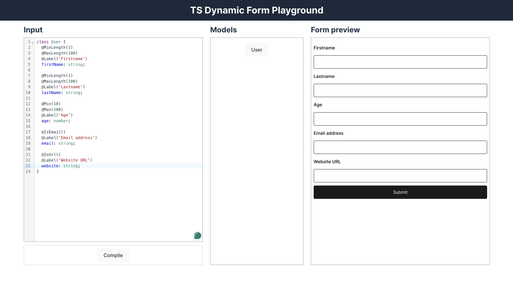

# Dynamic Forms TS

## Overview

**Dynamic Forms TS** is a TypeScript-first utility that simplifies the creation of dynamic, type-safe forms in React. It generates form schemas based on TypeScript models and dynamically builds forms using [React Hook Form](https://react-hook-form.com/). By aligning forms with your TypeScript types, it reduces manual form setup, minimizes boilerplate, and enhances code maintainability.

⚠️ **Note:** This module is experimental and not ready for production use. It is designed for testing and exploration while evaluating its applicability to real-world scenarios.

## Key Features

- **TypeScript-Driven**: Form schemas are automatically generated from your TypeScript models.
- **Dynamic Form Generation**: Build forms dynamically without manual configuration.
- **Seamless Integration**: Works natively with [React Hook Form](https://react-hook-form.com/).
- **Type-Safe**: Ensures all form fields align with your TypeScript definitions.
- **Customizable and Extensible**: Provides full flexibility for custom use cases and extensions.

## Directory Structure

```bash
dynamic-forms-ts/
├── packages/
│   ├── core/            # Core logic for schema parsing and generation
│   ├── renderers/       # React components for rendering forms from schemas
│   ├── utils/           # Helper utilities and tools
│   └── plugins/         # Optional plugins for schema or form customization
├── README.md            # Documentation
└── package.json         # NPM configuration
```

## Installation

1. Clone the repository:
    ```bash
    git clone https://github.com/medric/dynamic-forms-ts
    cd dynamic-forms-ts
    ```

2. Install dependencies:
    ```bash
    npm install
    ```

## Usage

### 1. Define TypeScript Models

Start by defining your TypeScript model, which acts as the foundation for generating the form schema.

For now, **class-based models with decorators are preferred**, as they offer more comprehensive validation support and flexibility. Using the `type` syntax works only on the server-side with the `DynamicFormTsParser`, but the class syntax is more stable and recommended.

```ts
// Class-based syntax with decorators for validation
class User {
  @MinLength(1)
  @MaxLength(100)
  @Label('Name')
  firstName: string;

  @MinLength(1)
  @MaxLength(100)
  lastName: string;

  @Min(10)
  @Max(100)
  age: number;

  @IsEmail()
  email: string;

  @IsUrl()
  @Label('Website URL')
  website: string;

  address: Address;
}

class Address {
  @Length(10, 50)
  street: string;
}
```

Available decorators include:

```ts
@MinLength(10)
@MaxLength(10)
@Length(0, 10)
@Min(10)
@Max(10)
@Label('Label')
@IsEmail()
@IsUrl()
@Pattern('/^[A-Za-z]$/')
@Message('Please provide a valid value')
@Required()
```

Validation rules defined in these classes are used by the `<DynamicForm />` component, leveraging React Hook Form's validation system.

Alternatively, if you prefer the type syntax, note that this approach is **only functional server-side** using the `DynamicFormTsParser`. In the `DynamicFormTsParser`, comments are used for validation rules, but the annotations match the decorators used in the class-based syntax (e.g., `@MinLength`, `@MaxLength`, etc.):

```ts
// form-types.ts
type Ref1 = {
  name: string;
};

type MyType = {
  /**
   * @MinLength(5)
   * @MaxLength(10)
   */
  kind: string;

  ref: Ref1;

  refs: Ref1[];

  comments: string[];
};

// server.ts
import { DynamicFormTsParser } from './packages/core/';

const parser = new DynamicFormTsParser({
  formSchemaTypeDefinitionsFile: './example/schema.ts',
});

async function run() {
  const data = await parser.parse();
  const formSchema = JSON.stringify(data, null, 2);

  return formSchema;
}
```

### 2. Generate Form Schema

There are multiple ways to generate form schemas depending on the syntax you're using:

- **Prefer `type` syntax**: Use `DynamicFormTsParser` for server-side schema generation. This parser relies on leading comments for validation annotations.
- **Prefer `class` syntax**: Use `DynamicFormParser` or `DynamicFormWasmParser` for schema generation on both client and server. These parsers leverage decorators for validation.

#### DynamicFormParser & DynamicFormWasmParser

Under the hood, both `DynamicFormParser` and `DynamicFormWasmParser` use [swc](https://swc.rs/) to parse the TypeScript code. However, these parsers **do not support type declaration syntax** and work exclusively with class-based models.

```ts
import { DynamicFormNodeParser } from 'dynamic-forms-ts';

const parser = new DynamicFormNodeParser({ filename: 'schema.ts' });
const formSchema = parser.parse();
```

For Vite users, the provided `generateFormSchemaVitePlugin` automates schema generation:

```ts
import { defineConfig } from 'vite';
import react from '@vitejs/plugin-react';
import { generateFormSchemaVitePlugin } from 'dynamic-forms-ts';

export default defineConfig({
  plugins: [react(), generateFormSchemaVitePlugin()],
});
```

#### DynamicFormTsParser (Server-Side Parsing)

When using `type` syntax, schema generation must be done server-side, typically during build time:

```ts
import { DynamicFormTsParser } from 'dynamic-forms-ts';

const parser = new DynamicFormTsParser({ filename: './schema.ts' });
const formSchema = parser.parse();
```

#### Client-Side Schema Parsing

For client-side parsing of class-based syntax:

```ts
import { DynamicFormWasmParser } from 'dynamic-forms-ts';

const dynamicFormParser = new DynamicFormWasmParser();

const code = `
type User = {
  name: string;
  age: number;
};
`;

const formSchema = dynamicFormParser.parseInline(code);
```

### 3. Render a Dynamic Form

Once you've generated the schema, the `DynamicForm` component will dynamically render your form:

```tsx
import React from 'react';
import { DynamicForm } from 'dynamic-forms-ts';

const UserForm = () => (
  <DynamicForm
    model="User"
    formSchema={formSchema}
    onSubmit={handleUserFormSubmit}
    level={0}
    title="User"
  />
);

export default UserForm;
```

### 4. Customize

You can customize the form by adding validation rules, default values, or other configurations directly within the schema.

### 5. JSON Schema Generation

The generated form schema can be represented in a JSON structure, which outlines the models, types, and validation rules for form generation. Below is an example of a generated JSON schema:

```json
{
  "models": {
    "Ref1": { "name": { "type": "string", "required": true } },
    "MyType": {
      "kind": {
        "type": "string",
        "validators": { "minLength": 5, "maxLength": 10 },
        "required": true
      },
      "order": { "type": "number", "required": true },
      "ref": { "type": "object", "ref": "Ref1", "required": true },
      "refs": { "type": "array", "ref": "Ref1", "required": true },
      "comments": { "type": "array", "ref": "string", "required": true }
    }
  },
  "enums": {}
}
```

This schema defines the models and their properties, including validation rules such as `minLength`, `maxLength`, `required`, and references to other models. It is used to dynamically generate forms that adhere to the TypeScript model definitions.

## Test & Build the Package Locally

To test the module, link it as a local npm package:

```bash
npm link
```

## Preview Editor

The **Preview Editor** allows you to visualize and interact with the dynamically generated forms in real-time.

#### How to Use the Preview Editor

1. **Run the Preview Editor:**
   
   ```bash
   npx dynamic-forms preview-editor
   ```

2. **Add TypeScript Types:**
   Modify TypeScript type or class definitions in the editor, which the library will automatically parse to generate the form.



## TODO/Next Steps

- **Additional Testing**: Write comprehensive unit and integration tests.
- **Publish to NPM**: Prepare the project for public release on [npm](https://www.npmjs.com/).
- **Support for More Types**: In the future, add support for additional field types like files, dates, etc.

## Contributing

Contributions are welcome! Fork the repository and submit a pull request.

## License

This project is licensed under the MIT License.
